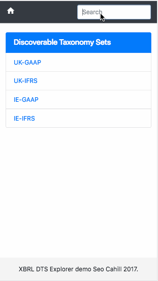

[](https://codeclimate.com/github/seocahill/dts-explorer-client)  [](https://codeclimate.com/github/seocahill/dts-explorer-client/coverage) [](https://travis-ci.org/seocahill/dts-explorer-client)

# DTS explorer

This is a sample ember application that displays a simple interface for viewing a parsed XBRL discoverable taxonomy set.

## Demo

In the demo below you can see a search traced from the discoverable taxonomy set ("UK GAAP") through the role-type sections, then via the main parent-child presentation tree to an element value. 

Elements are used to tag financial facts in a set of accounts.

The second search targets an element/tag and then traverses the dimensional tree for that tag which encompasses many networks (all, hypercube, domain, member). 

Dimension domain member tags are used to disambiguate similarly tagged financial facts.

For in-depth information on how XBRL works, check out the xbrl tagged articles [on my blog](//blog.seocahill.com) or the [XBRL homepage](https://en.wikipedia.org/wiki/XBRL).



## Dockerfile

I've provided two Dockerfiles one based on alpine linux and one based on debian.

Both compile watchman first and copy the binary into the main image.

The alpine version is much smaller and installs chromium as the CI browser.

The debian version installs chrome stable.

## Installing and running

Run ```docker-compose build``` with your choice of dockerfile if you don't already have an image.

Next you need to install the node packages:

```
docker-compose run app npm install (or yarn install)
```

You should now be able to run the app:

```
docker-compose up -d
```

Browse to port 4200 to see the app live.

In development the app loads some test fixtures to make it usable. The test fixtures are a small subsection of the UK GAAP taxonomy.

## Tests

If using the debian version remember to change the launcher command in ```testem.js``` to "Chrome" instead of "Chromium".

Otherwise run the tests as normal either in an tty on the app container of via ```docker-compose run```.

If you run the test server you can connect to your local machines Chrome on port 7357

You can also debug locally using port 9222

## Livereload

Port 7020 is used for the livereload server.
